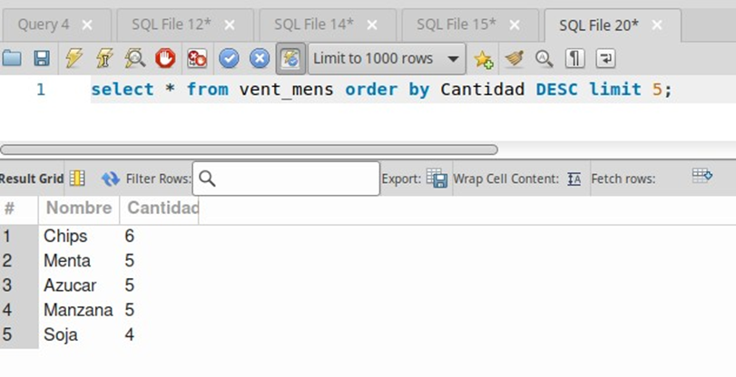

Trabajo Práctico 1 

Base de datos II 

Fundamentos, Integridad y Concurrencia 

Ejercicio 1:

En el siguiente ejemplo si queremos eliminar un alumno de la tabla “Alumnos” y este pertenece a una Asignatura, generaría que estas tengan un id ya no existente. Para evitar esto usamos “ON DELETE RESTRICT” para que no se pueda eliminar un alumno que tenga asignaturas asociadas. También podríamos usar “ON DELETE CASCADE” para que también se elimine la asignatura referente al alumno eliminado. 

Ejercicio 2: 

En el siguiente ejemplo agregamos la Matrícula la cual asigna una asignatura a un alumno existente. En este caso tratamos de agregar un alumno inexistente (99), a la matrícula (2) que es Historia, esto resulta en un error gracias a la restricción de la clave foránea. 

Error: Query Error: Cannot add or update a child row: a foreign key constraint fails (`test`.`Matricula`, CONSTRAINT 
`Matricula_ibfk_1` FOREIGN KEY (`id_alumno`) REFERENCES `Alumnos` (`id`) ON DELETE CASCADE) 

Ejercicio 3: 

En el siguiente ejemplo podemos observar 2 transacciones que ocurrirían al mismo tiempo, una está mostrando el saldo de una cuenta, mientras que la otra lo está modificando. Si usamos el nivel de aislamiento READ COMMITTED,  la primera transacción podría leer el valor 1000, y si vuelve a hacer el mismo SELECT más tarde en la misma transacción, podría obtener el valor 500 si la segunda transacción ya hizo commit. 

En el siguiente ejemplo podemos observar las mismas transacciones pero esta vez usando el nivel de aislamiento SERIALIZABLE, esto hace que se ejecuten de manera serializada (Una detrás de otra) por lo tanto el UPDATE de la Sesión 2 no podrá continuar mientras la transacción de la sección 1 este abierta. Tiene que esperar a que esta realice COMMIT. 

Este nivel es el más estricto ya que las transacciones se ejecutan de manera aislada, evitando lecturas fantasma. 

Ejercicio 4: 
En este ejercicio lo primero que hacemos es crear una base de datos “Personas” e le insertamos varios registros: 

Luego realizamos una consulta donde quiero que me devuelva las personas con más de 25 años, primero realizamos esta consulta sin índice, después creamos el índice y realizamos nuevamente la misma consulta consulta: 

Podemos notar que la consulta que realizamos con índice es minimamente más rápida que la consulta sin índice. 

Ejercicio 5: 

En este ejercicio vamos crear primero una base de datos para guardar juegos: sus nombre, género, valoraciones, y fecha de salida: 

Le insertamos a la tabla varios registros para luego realizar una consulta, donde básicamente quiero que me devuelva los nombres de los juegos que sean del género ’’Aventura’’ y que su valoración sea mayor a 9.0. 

Primero vamos a realizar esta consulta sin utilizar índices, para luego crearlos y comparar el rendimiento de ambas consultas 

Como podemos ver la consulta que realizamos con índice es minimamente más rápida que la consulta sin índice. 

Ejercicio 6: 

Para este ejercicio, primero creamos dos tablas, una para registrar los “Productos”: sus nombre y precios, y otra tabla para registrar las “Ventas” de los productos a partir de su ID: 

Luego creamos una vista para ver las ventas mensuales de cada producto registrado: 

Después utilizamos la vista que creamos anteriormente para usarla dentro de una consulta para que nos devuelva los primero 5 productos más vendidos: 

Ejercicio 7: 

En este ejercicio, primero vamos a crear un usuario llamado “Analista” dónde vamos darle a través del usuario root, la función de realizar “Select” en la base de datos que queramos. 

Primero creamos el usuario “Analista”: 

Segundo le damos privilegios (solo la función select en la base de datos llamada “Empleados”) y aplicamos los cambios: 

y Tercero, a la hora que el usuario analista quiera hacer una función que no tiene permitida sucede esto: 

Le tira un error, diciendo que la función de insertar datos en una tabla no la tiene permitida.

Ejercicio 8: 

En este ejercicio para poder simular una auditoría con triggers vamos a hacerlo en varios pasos. 

Primero creamos una tabla, en este caso una tabla “empleados” donde guardaremos datos de empleados: 

Luego creamos otra tabla llamada “auditoria_empleados”, donde guardaremos los registro de los cambios que se van a ir haciendo en la tabla empleados: 

Después creamos tres triggers, que nos van a ayudar a registrar los cambios que suceden en la tabla “empleados”, ya sea agregando nuevos empleados, actualizando empleados o eliminando empleados: 

Agregar empleados: 

Actualizar empleados: 

Eliminar empleados: 

Luego de crear las tablas y triggers vamos a probar si funciona. 

A la hora de agregar un usuario en la tabla “Empleados: 

Podemos ver que en la tabla de “auditoria_empleados” queda registrado el “insert” que hicimos anteriormente.

Cuando actualizamos un empleados en la tabla “Empleados: 

Podemos notar que en la tabla “auditoria_empleados” queda registrado el “update” que hicimos anteriormente. 

Y Cuando queremos eliminar un empleado en la tabla “Empleados”: 

Podemos ver que en la tabla “auditoria_empleados” queda registrado el “delete” que hicimos recién. 
Ejercicio 9: 

Video paso a paso cómo hacer un Backup y Restore de una base de datos desde Powershell.

Video: https://drive.google.com/file/d/1eVAep_Te2_NgO6WdOe9WQhIFUQMnmMdn/view?usp=sharing
